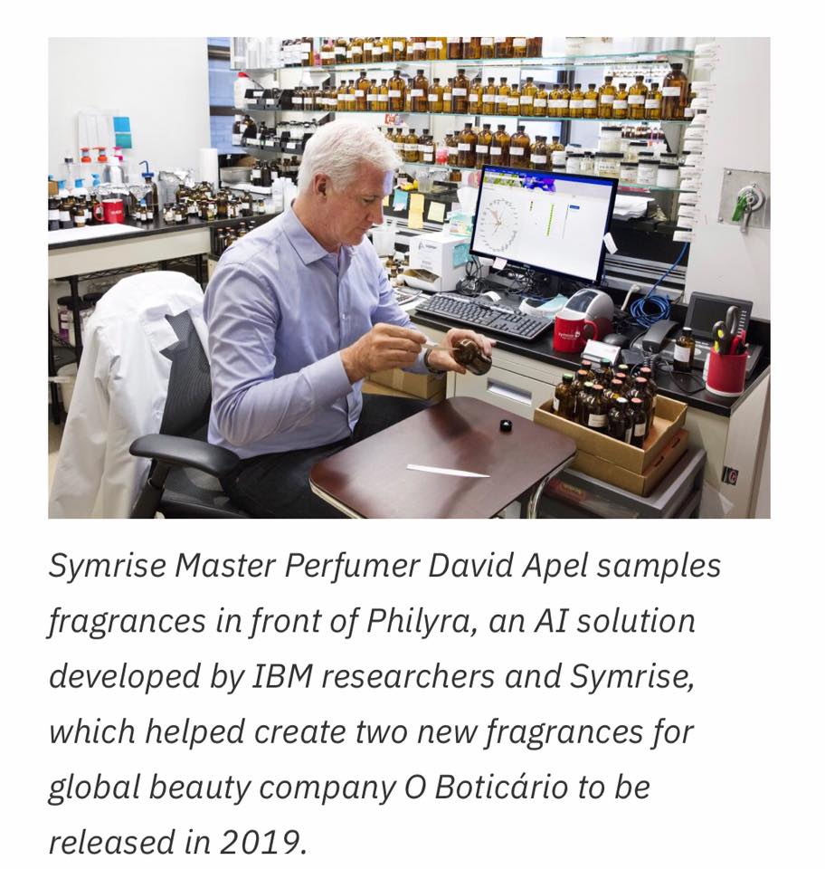
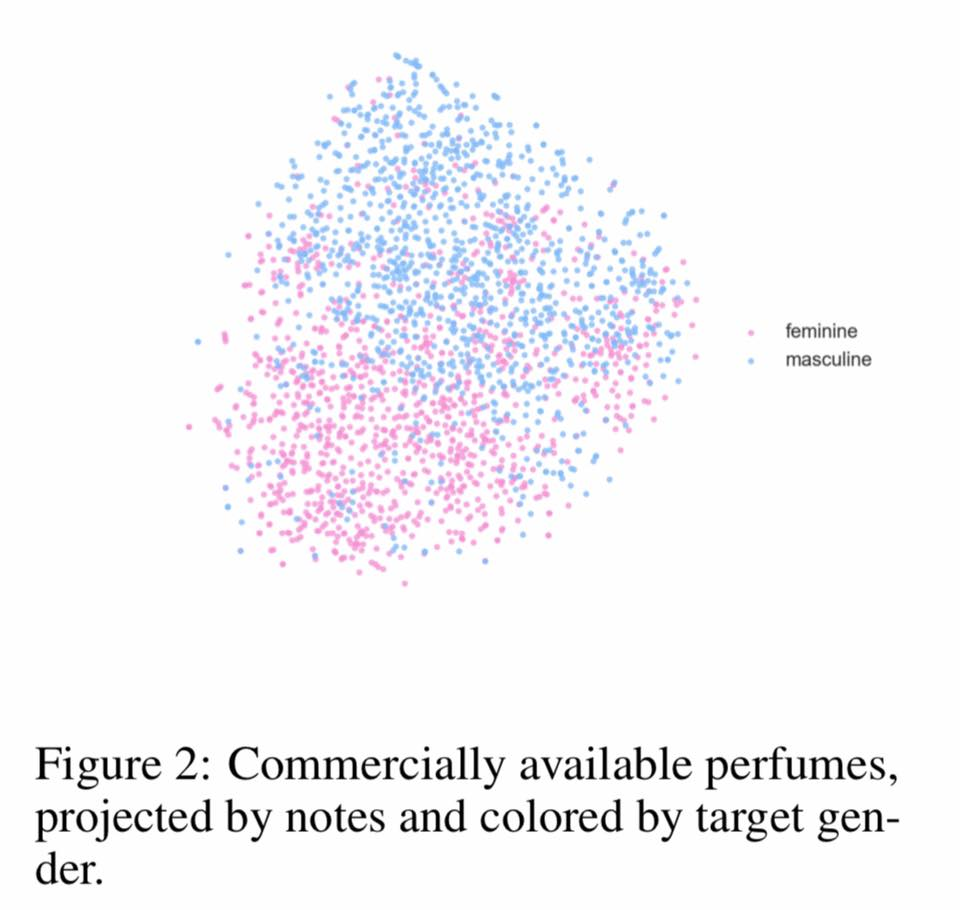

# Using-AI-to-Create-New-Fragrances

Smell nice with Artificial Intelligence perfume. Philyra, by IBM Research and Symrise

The AI system is able to sift through hundreds of thousands of formulas and thousands of raw materials, helping identify patterns and novel combinations.

With input of 1,300 scent building blocks, it uses deep-learning algorithm to output unique perfume formulas that should perform well for a target group, 
unencumbered with cultural bias, personal preference, knowledge, experience or comfort with a substance

Read more at http://bit.ly/2yWh7L5
